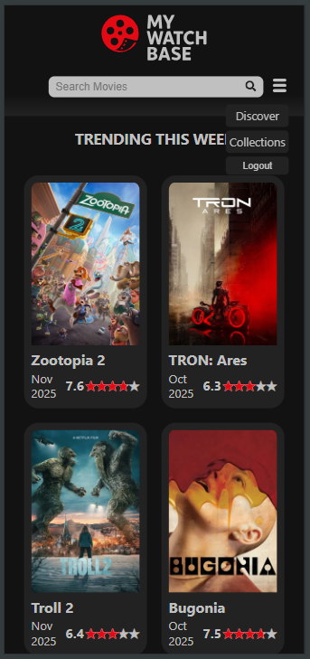
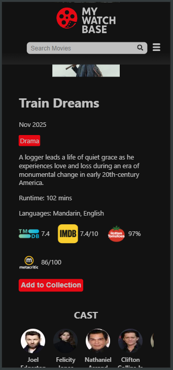
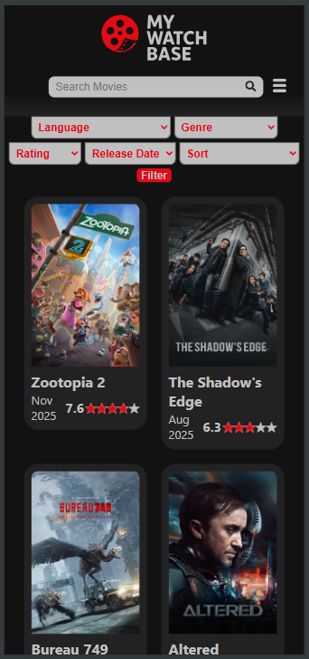
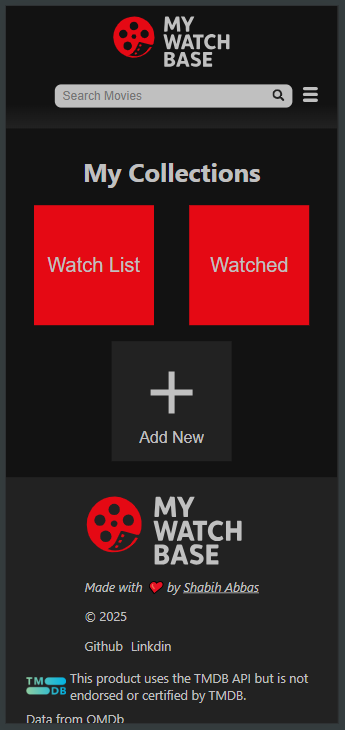
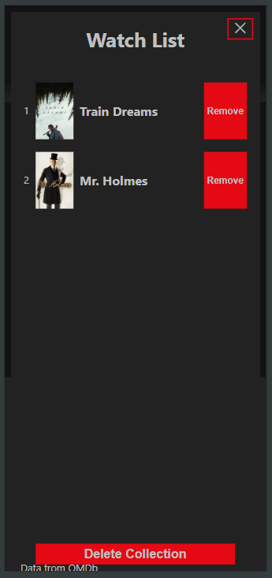

# My WatchBase 🎬


**My WatchBase** is a full-stack movie exploration and tracking application. It serves as a personal companion for movie enthusiasts, allowing users to discover new titles, view comprehensive details, and manage their streaming history through custom collections.

🔗 **[Live Demo]()**

## 🚀 Features

* **Discover & Explore:** Browse trending, upcoming, and top-rated movies with data sourced from **TMDB**.
* **Deep Metadata:** View detailed information including ratings, cast, and plot summaries, aggregated from both **TMDB** and **OMDB**.
* **Custom Collections:** Create personalized lists (e.g., "Watchlist," "Favorites," "Watched") to organize your movie journey.
* **Streaming History:** Keep a log of movies you have watched.
* **Secure Authentication:** User registration and login protected by **JWT (JSON Web Tokens)** and secure password hashing.
* **Responsive Design:** A seamless UI built with **CSS Modules** ensuring compatibility across devices.

## 🛠 Tech Stack

**Frontend:**
* **React.js:** Component-based UI architecture.
* **React Router:** Client-side routing for a generic Single Page Application (SPA) experience.
* **CSS Modules:** Scoped styling for modularity.

**Backend:**
* **Node.js & Express:** Custom middleware API that proxies requests to external services.
* **MongoDB & Mongoose:** NoSQL database for user profiles and collection data.
* **JWT:** Stateless authentication mechanism.

**External APIs:**
* **TMDB (The Movie Database):** Primary movie data.
* **OMDB (Open Movie Database):** Supplementary ratings and details.

## 📸 Screenshots

| Home Page | Movie Details | Discover | Collections | Modal |
| :---: | :---: | :---: | :---: | :---: |
|  |  |  |  |  |

## 🏗 Architecture

MyWatchBase utilizes a decoupled **Client-Server** architecture:

1.  **Middleware API:** The Express server acts as a secure gateway. It holds the sensitive API keys (TMDB/OMDB) so they are never exposed to the client.
2.  **Data Aggregation:** The backend fetches data from multiple sources, formats it, and sends a clean JSON response to the React frontend.
3.  **State Management:** The frontend handles UI state while communicating with the backend via RESTful endpoints.

## ⚙️ Installation & Setup

If you want to run this project locally, follow these steps:

### Prerequisites
* Node.js (v14+)
* MongoDB (Local instance or Atlas URI)

### 1. Clone the repository
```bash
git clone [https://github.com/shabih-abbas/mywatchbase.git](https://github.com/shabih-abbas/mywatchbase.git)
cd mywatchbase
```
### 2. Backend Setup
```bash
cd server
npm install
```
Create a .env file in the server root and add your variables:
```
MONGO_URI=your_mongodb_connection_string
JWT_SECRET=your_jwt_secret_key
TMDB_BASE_URL=tmdb_base_url
TMDB_API_KEY=your_tmdb_key
OMDB_BASE_URL=omdb_url_with_your_omdb_key
```
Start the server:
```bash
npm run dev
```
### 3. Frontend Setup
```bash
cd client
npm install
```
Start the React development server:
```bash
npm start
```
## 🤝 Contributing
Contributions, issues, and feature requests are welcome!
## 📄 License
This project is open source and available under the MIT License.
